```mermaid
gantt
    title 🚀 Axon Flow - Chunk-Based Implementation Roadmap
    dateFormat  YYYY-MM-DD
    axisFormat Week %W

    section 🏗️ Phase 1: Foundation (COMPLETE)
    F1 Monorepo Setup        :done, f1, 2025-01-01, 3d
    F2 Shared Packages       :done, f2, after f1, 4d
    F3 Docker Environment    :done, f3, after f1, 3d
    F4 CI/CD Pipeline        :done, f4, after f2, 2d
    I1 RabbitMQ Foundation   :done, i1, after f3, 3d
    I2 Database Foundation   :done, i2, after f3, 3d
    I3 Redis Caching         :done, i3, after f3, 2d

    section ⚙️ Phase 2: Core Services (IN PROGRESS)
    S1.1 Registry Core       :done, s11, after i1, 4d
    S1.2 Capability Mgmt     :done, s12, after s11, 3d
    S5.1 JWT Authentication  :s51, after i2, 4d
    S2.1 GraphQL Gateway     :s21, after s51, 5d
    S3.1 Hub Task Ingestion  :s31, after s21, 3d
    S3.2 LLM Provider        :s32, after s31, 4d

    section 🧠 Phase 3: Intelligence Layer
    X1 Hub-Registry Integration :x1, after s12, 2d
    S3.3 Plan Generation     :crit, s33, after s32, 5d
    S7.1 Agent Framework     :s71, after s11, 4d
    S7.2 Notification Agent  :s72, after s71, 3d
    S3.4 Task Dispatcher     :s34, after s33, 3d

    section 🎨 Phase 4: User Interface
    U1.1 Auth UI Flow        :u11, after s21, 4d
    U1.2 Task Creation UI    :u12, after u11, 5d
    S2.3 WebSocket Sub       :s23, after s21, 3d
    U1.3 Execution Monitor   :crit, u13, after u12, 6d
    X3 Frontend Integration  :x3, after u13, 3d

    section 🔧 Phase 5: Advanced Features
    S3.5 Saga Orchestration  :crit, s35, after s34, 5d
    S4.1 Container Lifecycle :s41, after s35, 4d
    S4.2 Resource Management :s42, after s41, 3d
    S6.1 Stripe Integration  :s61, after s51, 4d
    S6.2 Usage Tracking      :s62, after s61, 3d

    section 🚀 Phase 6: Production Ready
    S4.3 Auto-scaling        :s43, after s42, 3d
    S5.2 OAuth Providers     :s52, after s51, 3d
    U2.1 Analytics Dashboard :u21, after u13, 4d
    U2.2 User Management     :u22, after u21, 3d
    S2.2 Rate Limiting       :s22, after s21, 2d
```

<!-- Hero Banner with Gradient Background -->
<picture>
  <source media="(prefers-color-scheme: dark)" srcset="docs/assets/Banner.png">
  
</picture>

  

<!-- Animated Title with Gradient Text -->
<h1>
  
</h1>

<!-- CI Status Badges -->

  
  
  
  

<!-- Compelling Tagline with Visual Hierarchy -->
<h2 align="center">
  
</h2>

<h3 align="center">
  
</h3>

 

<!-- Elegant Navigation -->

  

  
  
  
  
  
  
  

 

<!-- Project Description with Visual Enhancement -->

  

 

  

  

  

After working with various AI automation tools, I identified critical gaps in
multi-agent systems. This project aims to build a robust platform guided by
three core philosophies:

|                          

**Architecture First**
                           |                 

**Extreme Modularity**
                 |                  

**Developer Centric**
                   |
| :-----------------------------------------------------------------------------------------------------------------------------------------------------------------------: | :----------------------------------------------------------------------------------------------------------------------------------------------------: | :------------------------------------------------------------------------------------------------------------------------------------------------------: |
| A robust, **Hub-Centric** microservices architecture prevents the "agent chaos" that plagues decentralized systems. I enforce strict, predictable communication patterns. | Every external dependency is abstracted behind a **Provider Pattern**. Swap LLMs, databases, or storage providers with a single line of configuration. | A world-class developer experience is paramount. Enjoy a one-command setup, hot-reloading, comprehensive testing, and rich debugging tools from day one. |
|                                       **Benefit:** Predictable, observable, and debuggable workflows, even with hundreds of agents.                                       |                          **Benefit:** No vendor lock-in. Unprecedented flexibility to adapt your stack as technology evolves.                          |                                 **Benefit:** Go from an idea to a functioning, multi-agent workflow in hours, not weeks.                                 |

  

  

  

| Feature                              | Description                                                                                                                                   |
| ------------------------------------ | --------------------------------------------------------------------------------------------------------------------------------------------- |
| 🧠 **LLM-Powered Orchestration**     | The **Hub** uses your chosen LLM to dynamically create execution plans based on user requests and the real-time availability of agents.       |
| 🔌 **Plug-and-Play Agents**          | Agents **self-register** their capabilities with a central **Registry**. The Hub discovers and utilizes them without any hardcoded knowledge. |
| 📊 **Real-Time Visualization**       | A live, node-based graph shows the flow of tasks, agent status, and data transformations as they happen.                                      |
| 🛠️ **Comprehensive Admin Dashboard** | A single pane of glass for managing agents, users, system configuration, feature flags, and billing.                                          |
| 🧱 **Provider Pattern Everywhere**   | Swap out LLMs, databases, storage, and notification services with zero code changes.                                                          |
| 🛡️ **Security-First Design**         | JWT authentication and secure message handling with planned multi-tenant capabilities.                                                        |
| 📈 **Modular Architecture**          | Built on microservices architecture with RabbitMQ, designed to grow from simple automation to complex workflows.                              |

  

  

  

The technology stack was chosen for its maturity, performance, and best-in-class
TypeScript support.

| Category               | Technology                                                                                                      | Purpose                                                         |
| ---------------------- | --------------------------------------------------------------------------------------------------------------- | --------------------------------------------------------------- |
| **Language & Runtime** |              | Type-safe development across all services.                      |
|                        |             | JavaScript runtime for all backend services.                    |
| **Backend Framework**  |                  | The microservice framework for the Hub and all Agents.          |
| **Database & Cache**   |        | Primary data store with `pgvector` for AI similarity search.    |
|                        |                     | Caching, real-time data, and job queueing.                      |
| **Message Broker**     |            | The central nervous system for all inter-service communication. |
| **Frontend**           |             | React framework for the user and admin dashboards.              |
| **UI & Styling**       |             | A highly customizable, accessible component library.            |
|                        |     | Utility-first CSS framework for consistent styling.             |
| **Deployment**         |                  | Containerization for all services.                              |
|                        |      | Container orchestration capabilities for deployment.            |
| **Monorepo & CI/CD**   |         | High-performance build system for the monorepo.                 |
|                        |  | Automated testing, building, and deployment.                    |

  

  

  

<!-- Achievement Cards Layout -->
<table style="width: 100%; max-width: 1200px; table-layout: fixed; border-collapse: collapse; margin: 0 auto;">
  <tr>
    <!-- System Architecture Card -->
    <td align="center" width="33.33%" style="vertical-align: top; padding: 15px;">
      

          
         
         
        
      

    </td>
    <!-- TypeScript Mastery Card -->
    <td align="center" width="33.33%" style="vertical-align: top; padding: 15px;">
      

          
         
         
        
      

    </td>
    <!-- DevOps Pipeline Card -->
    <td align="center" width="33.33%" style="vertical-align: top; padding: 15px;">
      

          
         
         
        
      

    </td>
  </tr>
  <tr>
    <!-- Performance Engineering Card -->
    <td align="center" width="33.33%" style="vertical-align: top; padding: 15px;">
      

          
         
         
        
      

    </td>
    <!-- Message-Driven Design Card -->
    <td align="center" width="33.33%" style="vertical-align: top; padding: 15px;">
      

          
         
         
        
      

    </td>
    <!-- Observability & Monitoring Card -->
    <td align="center" width="33.33%" style="vertical-align: top; padding: 15px;">
      

          
         
         
        
      

    </td>
  </tr>
</table>

  

  

  

Axon Flow is designed as a general-purpose multi-agent orchestration platform.
With our **Hub-centric architecture** and **dynamic agent discovery**, you can
build sophisticated automation workflows that scale from simple tasks to complex
enterprise solutions.

<!-- Capability Overview Cards -->
<table style="width: 100%; max-width: 1200px; table-layout: fixed; border-collapse: collapse; margin: 0 auto;">
  <tr>
    <!-- Development Status Card -->
    <td align="center" width="33.33%" style="vertical-align: top; padding: 15px;">
      

          
         
         
        
      

    </td>
    <!-- Available Capabilities Card -->
    <td align="center" width="33.33%" style="vertical-align: top; padding: 15px;">
      

          
         
         
        
      

    </td>
    <!-- Coming Soon Card -->
    <td align="center" width="33.33%" style="vertical-align: top; padding: 15px;">
      

          
         
         
        
      

    </td>
  </tr>
</table>

  

<!-- Use Case Examples with Enhanced Visual Design -->
<h3>🎯 Real-World Automation Examples</h3>

<table style="width: 100%; max-width: 1200px; table-layout: fixed; border-collapse: collapse; margin: 0 auto;">
  <tr>
    <!-- HR Automation Card -->
    <td align="center" width="33.33%" style="vertical-align: top; padding: 15px; min-height: 400px;">
      

        

          
        

        

          
<strong>🤖 Agent Fleet:</strong> 
           
           
           
           
          

        

        

          
<strong>⚡ Workflow:</strong> 
          <small>Scrapes job postings daily → Parses candidate resumes → Matches skills using LLM → Schedules interviews for top candidates → Sends notification</small>

        

      

    </td>
    <!-- Market Research Card -->
    <td align="center" width="33.33%" style="vertical-align: top; padding: 15px; min-height: 400px;">
      

        

          
        
    
        

          
<strong>🤖 Agent Fleet:</strong> 
           
           
           
           
          

        

        

          
<strong>⚡ Workflow:</strong> 
          <small>Monitors news and social media → Performs sentiment analysis → Aggregates data → Generates daily reports → Populates live dashboard</small>

        

      

    </td>
    <!-- DevOps Automation Card -->
    <td align="center" width="33.33%" style="vertical-align: top; padding: 15px; min-height: 400px;">
      

        

          
        

        

          
<strong>🤖 Agent Fleet:</strong> 
           
           
           
           
          

        

        

          
<strong>⚡ Workflow:</strong> 
          <small>Watches for error spikes → Correlates with metrics → LLM diagnoses root cause → Runs remediation scripts → Sends Slack notifications</small>

        

      

    </td>
  </tr>
</table>

 

<!-- Additional Use Cases -->
<table style="width: 100%; max-width: 1200px; table-layout: fixed; border-collapse: collapse; margin: 0 auto;">
  <tr>
    <!-- E-commerce Automation -->
    <td align="center" width="33.33%" style="vertical-align: top; padding: 15px; min-height: 200px;">
      

        

          
        

        

          
<strong>🤖 Capabilities:</strong> 
          <small>• Inventory management automation 
          • Customer behavior analysis 
          • Automated marketing campaigns 
          • Supply chain coordination</small>

        

      

    </td>
    <!-- Content Creation Pipeline -->
    <td align="center" width="33.33%" style="vertical-align: top; padding: 15px; min-height: 200px;">
      

        

          
        

        

          
<strong>🤖 Capabilities:</strong> 
          <small>• Research and fact-checking 
          • Multi-format content generation 
          • SEO optimization and publishing 
          • Social media distribution 
          • Performance analytics</small>

        

      

    </td>
    <!-- Financial Analysis Bot -->
    <td align="center" width="33.33%" style="vertical-align: top; padding: 15px; min-height: 200px;">
      

        

          
        

        

          
<strong>🤖 Capabilities:</strong> 
          <small>• Market data aggregation 
          • Risk assessment automation 
          • Compliance monitoring 
          • Report generation 
          • Alert and notification system</small>

        

      

    </td>
  </tr>
</table>

 

  

  

  

Axon Flow employs a **Puppeteer-Style Orchestration** model. The Hub is the
central puppeteer, and the Agents are the puppets. The Hub pulls all the strings
through message-based commands, ensuring there is a single, traceable source of
truth for any workflow.

```mermaid
graph LR
    %% ----------------------------------------------------------------------
    %% -- External Services & Users (Left Side)
    %% ----------------------------------------------------------------------
    subgraph external [🌐 User & External Services]
        direction TB

        subgraph users [👥 Users]
            direction TB
            end_user([<fa:fa-user-tie /> End User])
            admin_user([<fa:fa-user-shield /> Admin])
        end

        api_gateway[<fa:fa-door-open /> API Gateway]

        subgraph providers [🧩 External Providers]
            llm_provider([<fa:fa-brain /> LLM Provider])
        end

        users --> api_gateway
    end

    %% ----------------------------------------------------------------------
    %% -- Main Platform (Right Side)
    %% ----------------------------------------------------------------------
    subgraph platform [🚀 Axon Flow Platform]
        direction TB

        %% Grouping nodes inside their respective planes
        subgraph control_plane [🧠 Control Plane]
            direction TB
            hub("<b>🤖 Hub Orchestrator</b><br/>The Core Intelligence")
            registry("<b>📚 Agent Registry</b><br/>Service Discovery Catalog")
        end

        subgraph exec_plane [⚙️ Execution Plane]
            direction TB
            agent_orchestrator("<b>🛠️ Agent Orchestrator</b><br/>Manages Agent Lifecycles")
            subgraph fleet [🏭 Agent Fleet]
                direction LR
                agent_a("<b>🚢 Agent A</b><br/>")
                agent_b("<b>🚢 Agent B</b><br/>")
                agent_c("<b>🚢 Agent C</b><br/>")
            end
        end

        broker(("<div style='font-size:1.5em;'>🔄</div><b>Message Bus</b><br/>RabbitMQ"))

    end

    %% ----------------------------------------------------------------------
    %% -- Connections & Data Flow (Error-Free Labels)
    %% ----------------------------------------------------------------------
    %% Primary Flow (Solid Lines)
    api_gateway -- "User Task" --> hub
    hub -- "Generates Plan" --> llm_provider
    llm_provider -- "Returns Plan" --> hub
    hub -- "Dispatches Task" --> broker
    broker -- "Delivers Task" --> fleet
    fleet -- "Reports Status" --> broker
    broker -- "Returns Status" --> hub

    %% Secondary/Control Flows (Dashed Lines)
    hub -.->|"Queries Agents"| registry
    registry -.->|"Returns Capabilities"| hub
    hub -.->|"Manages Lifecycle"| agent_orchestrator
    agent_orchestrator -.->|"Controls Containers"| fleet
    fleet -.->|"Announces on Startup"| registry


    %% ----------------------------------------------------------------------
    %% -- Styling Definitions (Robust & Compatible)
    %% ----------------------------------------------------------------------
    classDef default fill:#1a1a1a,stroke:#7a7a7a,color:#fff

    %% Subgraph Styles
    classDef platform fill:transparent,stroke:#00aaff,stroke-width:2px,color:#00aaff
    classDef control_plane fill:#003d66,stroke:#0077ff,stroke-width:2px
    classDef exec_plane fill:#004d3d,stroke:#00c896,stroke-width:2px
    classDef fleet fill:#004d3d,stroke:#00c896,stroke-width:1px,stroke-dasharray:5 5
    classDef external fill:transparent,stroke:#999,stroke-width:2px,color:#999
    classDef users fill:#3c1a66,stroke:#96f,stroke-width:1px
    classDef providers fill:#663d1f,stroke:#f93,stroke-width:1px

    %% Node Styles
    classDef hub fill:#e6f7ff,stroke:#0077ff,stroke-width:3px,color:#333
    classDef registry fill:#f0e6ff,stroke:#96f,stroke-width:2px,color:#333
    classDef agent_orchestrator fill:#e6fff7,stroke:#00c896,stroke-width:2px,color:#333
    classDef agent_a,agent_b,agent_c fill:#f0fff0,stroke:#228B22,stroke-width:2px,color:#333
    classDef broker fill:#fff8e6,stroke:#f93,stroke-width:3px,color:#333
    classDef api_gateway fill:#333,stroke:#96f,stroke-width:2px,color:white
    classDef end_user,admin_user fill:#222,stroke:#96f,stroke-width:2px,color:white
    classDef llm_provider fill:#282828,stroke:#f93,stroke-width:2px,color:white

    %% Apply subgraph styles
    class platform platform
    class control_plane control_plane
    class exec_plane exec_plane
    class fleet fleet
    class external external
    class users users
    class providers providers

    %% Apply node styles
    class hub hub
    class registry registry
    class agent_orchestrator agent_orchestrator
    class agent_a,agent_b,agent_c agent_a
    class broker broker
    class api_gateway api_gateway
    class end_user,admin_user end_user
    class llm_provider llm_provider
```

  

  

  

The roadmap follows a **chunk-based implementation strategy** with ~50
micro-implementations, each designed for 2-5 days of focused work. Value emerges
incrementally with every completed chunk.

<!-- Progress Status with Visual Indicators -->

<h3>🎯 Current Implementation Status</h3>

  

<table>
<tr>
<td align="center" width="16.6%">
 

</td>
<td align="center" width="16.6%">
 

</td>
<td align="center" width="16.6%">
 

</td>
<td align="center" width="16.6%">
 

</td>
<td align="center" width="16.6%">
 

</td>
<td align="center" width="16.6%">
 

</td>
</tr>
<tr>
<td align="center" width="16.6%">
 

</td>
<td align="center" width="16.6%">
 

</td>
<td align="center" width="16.6%">
 

</td>
<td align="center" width="16.6%">
 

</td>
<td align="center" width="16.6%">
 

</td>
<td align="center" width="16.6%">
 

</td>
</tr>
</table>

 

<!-- Progress Metrics -->

  
  
  

 

<!-- Enhanced Mermaid Roadmap -->

<!-- Phase Details with Visual Cards -->

<h3>📋 Implementation Phases Overview</h3>

<table>
  <tr>
    <!-- Phase 1 -->
    <td align="center" width="33%" style="vertical-align: top; padding: 10px;">
      

         
         
         
        
      

    </td>
    <!-- Phase 2 -->
    <td align="center" width="33%" style="vertical-align: top; padding: 10px;">
      

         
         
         
        
      

    </td>
    <!-- Phase 3 -->
    <td align="center" width="33%" style="vertical-align: top; padding: 10px;">
      

         
         
         
        
      

    </td>
  </tr>
  <tr>
    <!-- Phase 4 -->
    <td align="center" width="33%" style="vertical-align: top; padding: 10px;">
      

         
         
         
        
      

    </td>
    <!-- Phase 5 -->
    <td align="center" width="33%" style="vertical-align: top; padding: 10px;">
      

         
         
         
        
      

    </td>
    <!-- Phase 6 -->
    <td align="center" width="33%" style="vertical-align: top; padding: 10px;">
      

         
         
         
        
      

    </td>
  </tr>
</table>

<!-- Next Milestones -->

<h3>🎯 Immediate Next Steps</h3>

  

   
   
  

  

  

  

### 🚨 License & Usage Restrictions

**© 2025 Cosmin Fuica. All rights reserved.**

This software is **proprietary and confidential**. The source code, architecture
designs, and implementation methodologies contained herein are the intellectual
property of the author.